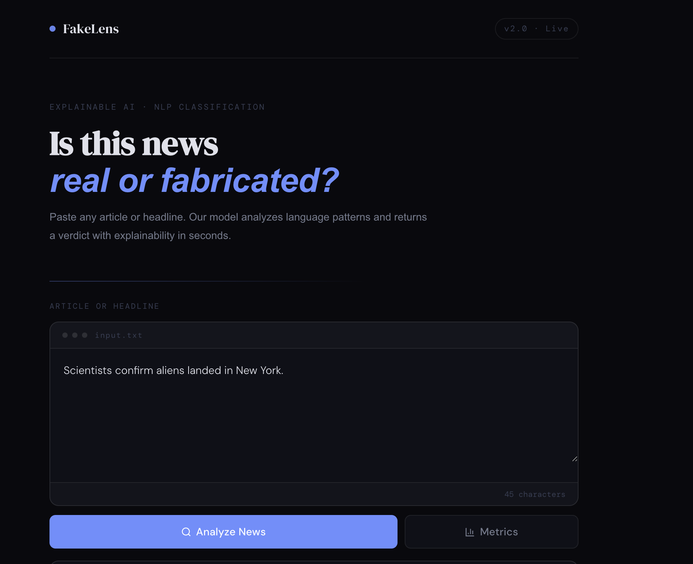
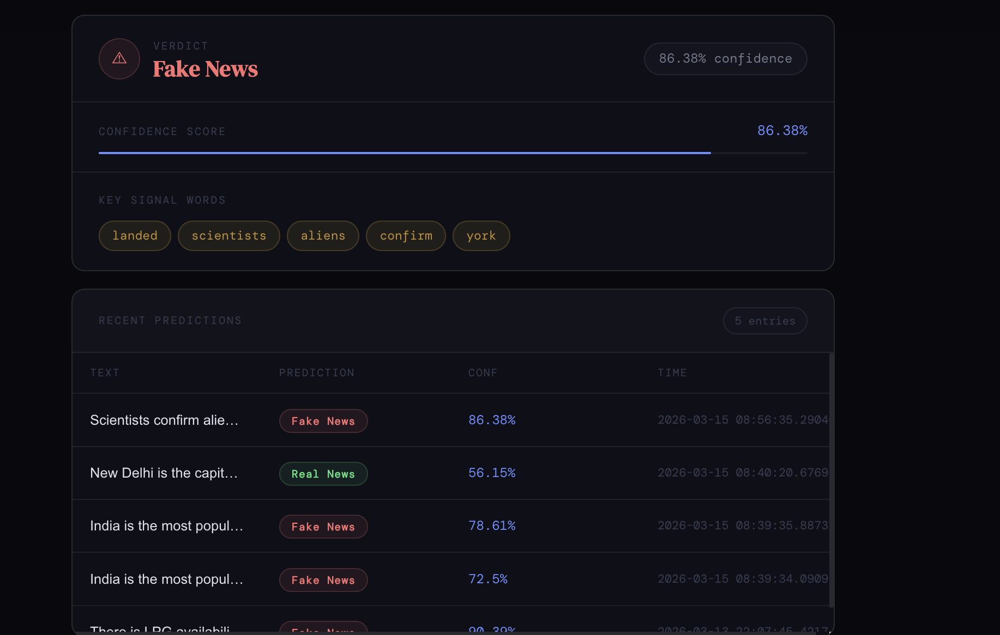

# 📰 AI Fake News Detector

An AI-powered web application that analyzes news text and predicts whether the information is **Real or Fake** using **Natural Language Processing (NLP) and Machine Learning**.

The application allows users to enter a news headline or article and instantly receive a prediction from the trained AI model.

---

## 🚀 Project Overview

Fake news spreading across digital platforms has become a serious issue. This project aims to solve this problem by building a **machine learning-based system** that can detect whether a news article is fake or real.

The system processes user input using **NLP techniques**, converts the text into numerical features using **TF-IDF vectorization**, and then uses a trained **classification model** to predict the authenticity of the news.

---

## ✨ Features

- Detects **Fake vs Real news**
- Simple and user-friendly interface
- Real-time predictions
- NLP-based text processing
- Machine learning text classification
- API communication between frontend and backend
- Lightweight and easy to run locally

---

## 🧠 How It Works

1. The user enters a news headline or article.
2. The text is sent to the backend server.
3. The system preprocesses the text using NLP techniques.
4. The trained machine learning model analyzes the text.
5. The application returns a prediction:
   - **Fake News**
   - **Real News**

---

## 🛠 Tech Stack

### Frontend
- React.js
- HTML
- CSS
- JavaScript

### Backend
- Python
- FastAPI

### Machine Learning
- Scikit-learn
- Natural Language Processing (NLP)
- TF-IDF Vectorization
- Text Classification Model

### Deployment
- Render (Backend)
- Vercel (Frontend)

---

---

## ⚙️ Installation & Setup

### 1. Clone the repository

git clone https://github.com/BIGSMOKE18/AI-fake-news-detector.git

### 2. Navigate to the project folder

cd AI-fake-news-detector

### 3. Install backend dependencies

pip install -r requirements.txt

### 4. Run the backend server

python api.py

### 5. Run the frontend

npm install  
npm run dev

---

## 💻 Usage

1. Open the application in your browser.
2. Enter a **news headline or article**.
3. Click on **Analyze / Detect**.
4. The AI model will classify the news as **Fake or Real**.

---

## 📸 Application Interface

Add a screenshot of your application interface in the screenshots folder.

Example:

---

## 📊 Example Prediction

Input:

Breaking: Scientists confirm aliens landed in New York.

Output:

Prediction: Fake News  
Confidence Score: 87%

---

## 🔮 Future Improvements

- Use **BERT or Transformer models** for better accuracy
- Improve dataset size
- Add explainable AI predictions
- Deploy full stack version online
- Integrate fact-checking APIs

---

## 👨‍💻 Author

Ayush Dhar  

Final Year IT Engineering Student

---

## ⭐ Support

If you like this project, consider giving it a **star ⭐ on GitHub**.
